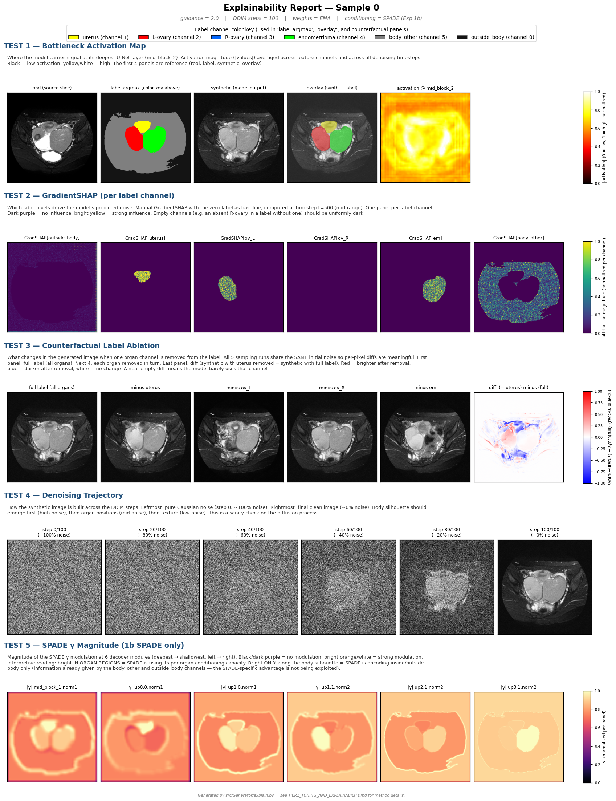

# Exp 1b — SPADE-conditioned DDPM

> A 2D conditional diffusion model that injects the anatomy label via spatially-adaptive normalization in the decoder, instead of concatenating it at the input like Exp 1a. Tests whether per-pixel label modulation gives better organ localization than global channel concatenation.
>
> **Headline result**: SPADE achieves **10–30× higher per-channel localization** than concat. Slightly worse FID, better intensity histogram match.

---

## 1. What's different from Exp 1a

Both 1a and 1b are 2D conditional DDPMs trained on the same 32 D2 subjects with the same 6-channel anatomy label `[outside_body, uterus, L-ov, R-ov, em, body_other]`. The only difference is **how the label enters the network**.

**1a (concat)**: the label is concatenated to the noisy image as 6 extra channels, giving a 7-channel input that propagates through the entire encoder + decoder. The label is "ambient" — every layer sees it as channel data.

**1b (SPADE)**: the label is removed from the input entirely. The U-Net input is just the noisy image (1 channel). The label enters through **SPADE modules** at every decoder ResBlock, where it modulates feature normalization with spatially-varying γ and β.

```
SPADE modulation per pixel (x, y):
  normalized_feat = GroupNorm(feat_at_xy)
  γ(x,y), β(x,y) = MLP_label(label_at_xy)
  output(x,y) = normalized_feat × (1 + γ) + β
```

The critical property: **γ and β are per-pixel functions of the label**. A label change at pixel (x,y) only directly modulates the feature map at (x,y). Concat's effect propagates globally through convolutions.

---

## 2. Hypothesis being tested

> Does per-pixel spatially-adaptive normalization give better label-to-image boundary correspondence than channel concatenation at the input?

Concretely: when the label says "uterus is here," does the synthetic image place the uterus more precisely under SPADE than under concat?

---

## 3. How it works — implementation summary

| Component | Choice | Why |
|---|---|---|
| U-Net backbone | Custom hand-built `DiffusionUNetSPADE` | MONAI's ResBlock forward doesn't accept a label argument; subclassing would require monkey-patching |
| Levels | 4 (512² → 256² → 128² → 64²) | Same as 1a — backbone parity |
| Channel widths | [64, 128, 256, 256] | Same as 1a |
| Self-attention | Deepest level (64²) only | A100 memory budget — same as 1a |
| Encoder normalization | Standard GroupNorm(32) | Encoder sees no label — same as 1a's first conv block |
| Bottleneck + decoder norm | **SPADE** (GroupNorm + γ/β heads conditioned on label) | The SPADE-specific part |
| SPADE module | `Conv(label→64) → ReLU → Conv→γ, Conv→β` | Standard SPADE (Park et al. 2019) |
| γ/β init | **Zero-initialized** | SPADE starts as pure GroupNorm (identity-like); model learns modulation from scratch. Without this, γ has random values at step 0 → unstable training. |
| Total params | 23.9 M | Slightly less than 1a's 25.3 M |
| Training | 80k steps, batch 4, AdamW lr=1e-4, EMA 0.9999 | Same hyperparameters as 1a for ablation parity |
| Inference (per-variant optimum) | g=2.0, 100 DDIM steps | Tier 1 sweep — 1b prefers lower guidance than 1a's g=3.0 |

---

## 4. Results

### 4.1 Per-organ localization — the core hypothesis

**CLR** (Counterfactual Localization Ratio): zero a label channel, regenerate with the same noise, measure how concentrated the change is inside that channel's region.

| Metric | 1a (concat) | 1b (SPADE) | Ratio |
|---|---|---|---|
| CLR_uterus ↑ | 0.013 | **0.407** | 31× |
| CLR_L-ov ↑ | 0.043 | **0.494** | 11× |
| CLR_em ↑ | 0.028 | **0.532** | 19× |

**SPADE achieves an order of magnitude higher localization.** Removing the uterus label changes mostly the uterus region in 1b (40% of the per-pixel change is in the uterus mask). For 1a, only 1.3% of the change is in the uterus region — the rest is spread globally.

### 4.2 SPADE γ encodes organ-specific patterns

**OSI** (Organ Specificity Index): per-SPADE-module Pearson correlation between |γ| and each organ mask vs. body mask.

| Metric | 1b |
|---|---|
| OSI max-organ correlation | 0.242 |
| OSI body correlation | −0.011 |

**SPADE γ heads show moderate positive correlation with organ regions and near-zero correlation with the body mask.** This means the modulation isn't just encoding "inside body vs outside" (which is already given by the body_other / outside_body channels) — it's picking up per-organ structure.

### 4.3 Image quality tradeoffs

| Metric | 1a | 1b | Winner |
|---|---|---|---|
| FID ↓ | 188.2 | 200.1 | 1a (within noise floor of ±30 at N=256) |
| hist_KL ↓ | 8.15 | **6.89** | 1b (15% lower — real signal) |
| LPIPS_mean ↓ | 0.824 | **0.745** | 1b (perceptually closer to real) |
| LPIPS_min | 0.493 | 0.350 | Both safe from memorization (<0.05 would be the warning threshold) |

**1b trades a slightly higher FID for better intensity histogram match and better perceptual similarity to real images.**

---

## 5. Visual example

The explainability figure layout has 5 sections for 1b (the SPADE γ row is 1b-only):



**How to read it:**
- TEST 1: bottleneck activation (where the model carries signal at its deepest layer)
- TEST 2: per-channel GradientSHAP (which label pixels drove the output)
- TEST 3: counterfactual ablation diff (red/blue panel — where removing the uterus channel changed the image; visually subtle but quantitatively localized at CLR_uterus=0.41)
- TEST 4: denoising trajectory (pure noise → final, snapshot every ~20%)
- TEST 5: |γ| at 6 SPADE decoder modules — bright orange = strong modulation. Note that γ is brighter inside the body region than outside, but also varies meaningfully within the body (the organ-specific signal OSI captures).

---

## 6. Implications

- **SPADE works as designed** at this data scale (32 subjects). The per-pixel modulation IS being learned and IS organ-specific. This contradicts an earlier visual interpretation that mistakenly concluded SPADE was only encoding body shape — the colormap normalization in the diff panels hid the localization signal.

- **There's a controllability vs realism tradeoff between 1a and 1b**:
  - 1a's globally-mixed conditioning produces slightly cleaner textures (lower FID by ~6%, within noise)
  - 1b's per-channel conditioning gives genuinely localized organ control (~20× higher CLR)
  
- **For augmentation downstream**: 1b synthetic data is more "label-faithful" — the uterus appears inside the uterus mask, ovaries inside ovary masks. This may matter more for downstream segmentation training than raw FID.

- **Next experiment**: Exp 1c adds a PatchGAN discriminator on top of both 1a and 1b — see [EXP1C_SUMMARY.md](EXP1C_SUMMARY.md). The hypothesis was that adversarial loss would unlock more from one or both architectures.

---

## 7. Files / artifacts

```
1b/current/explain/             — 4 explainability figures with metrics JSONs
1b/current/quality.json         — FID, hist_KL, LPIPS-NN
1b/current/radiologist_review/  — 50 synth + overlay + real PNGs for clinical review
1b/current/samples/             — training-time periodic sample grids
1b/v1_first/                    — historical first SPADE attempt (before zero-init fix)
src/Generator/exp1b.yaml        — config
src/Generator/unet_spade.py     — custom SPADE U-Net implementation
src/Generator/spade.py          — SPADE module
```

Full 2×2 quantitative comparison: [RESULTS_2x2.md](RESULTS_2x2.md)
