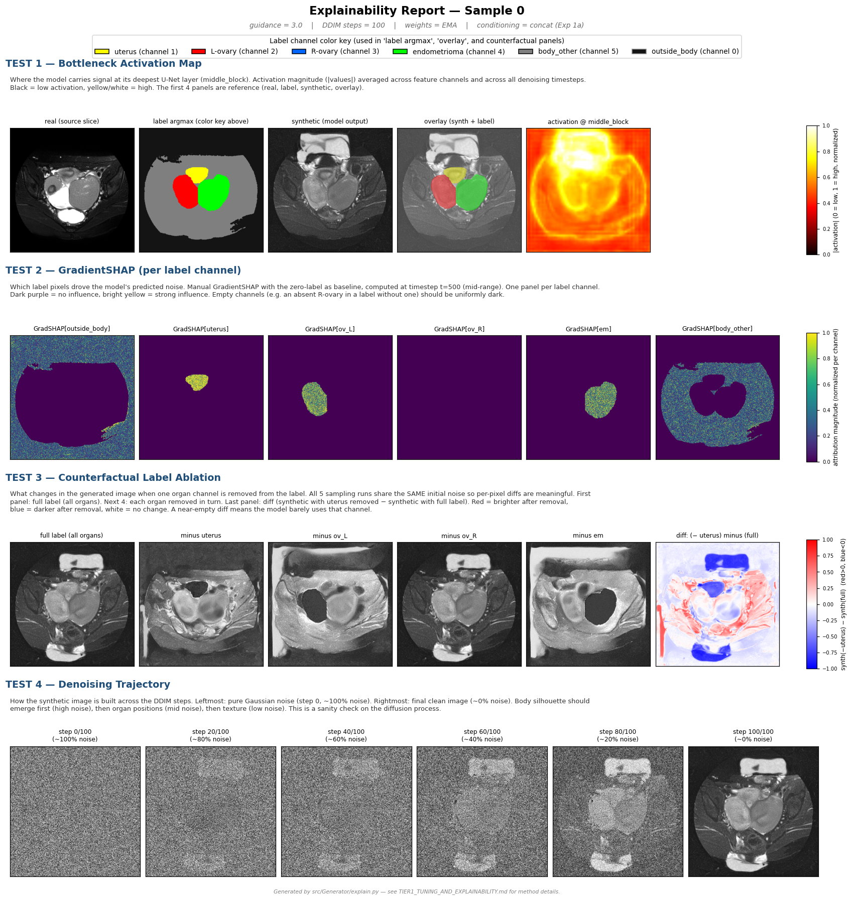
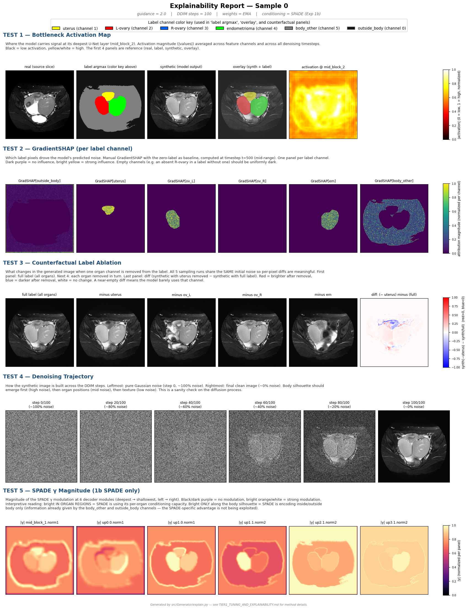

# Exp 1c — Conditional PatchGAN on top of both 1a and 1b

> A 2-arm experiment that adds a conditional PatchGAN discriminator on top of each conditioning mechanism: 1c_concat = 1a + PatchGAN, 1c_spade = 1b + PatchGAN. Tests whether adversarial loss adds different value to the two architectures.
>
> **Headline result**: PatchGAN does different things to different architectures. On concat: big texture-realism win (best FID and hist_KL of all 4 variants). On SPADE: best perceptual realism (lowest LPIPS), keeps SPADE's per-channel localization.

---

## 1. How it complements 1a and 1b

The 1a vs 1b ablation revealed a clean tradeoff:
- **1a (concat)** dominated on texture realism (FID, hist_KL) but had near-zero per-channel localization
- **1b (SPADE)** dominated on per-channel localization (10–30× higher CLR than 1a) but had slightly worse texture realism

The question Exp 1c asks: **can adversarial loss give us both?**

- For 1a, adding PatchGAN tests whether texture realism gets even tighter — the diffusion MSE loss alone may not pressure the model toward the true conditional distribution as effectively as an adversarial signal can.
- For 1b, adding PatchGAN tests whether the slight texture-realism gap closes — perhaps the localized SPADE outputs benefit most from an explicit "is this realistic" learning signal.

The 2-arm design with the SAME PatchGAN architecture on both backbones isolates the adversarial contribution from the conditioning mechanism.

---

## 2. Hypothesis being tested

> Does adversarial loss + label-aware discriminator tighten label-image boundary correspondence AND improve texture realism, regardless of the underlying conditioning mechanism?

---

## 3. How it works — implementation summary

### Conditional PatchGAN discriminator

| Component | Choice | Why |
|---|---|---|
| Input | `concat(image, label_map)` — 7 channels | The "conditional" part: D learns BOTH realism AND label-image consistency |
| Architecture | 5-block PatchGAN (Isola et al. 2017), 70×70 receptive field, 32×32 patch logits | Standard pix2pix discriminator |
| Channels | 64 → 128 → 256 → 512 → 1 | Modest size (~2.7M params) |
| Normalization | **Spectral norm** on all weight layers (Miyato 2018) | Prevents D from saturating to 100% accuracy and killing G's gradient |
| Output | Per-patch real/fake logits | Local discrimination → forces texture realism without global mode collapse |

### Joint G + D training loop modifications

```
Each step:
  1. G forward → predict noise ε̂ given x_t and label
  2. L_diff = MSE(ε̂, true noise)                       ← same as 1a/1b
  3. x̂_0 = (x_t − √(1−ᾱ_t) · ε̂) / √(ᾱ_t)             ← cheap single-step x_0 estimate
  4. D forward on (real, label) AND on (x̂_0.detach(), label)
  5. L_D = BCE(D(real), 1) + BCE(D(fake.detach()), 0)
     → step D's optimizer
  6. L_adv = BCE(D(x̂_0), 1)                           ← G wants D to call fakes "real"
  7. L_G_total = L_diff + λ × L_adv
     → step G's optimizer
```

### Adversarial loss weight (λ) schedule

| Phase | Steps | λ | Purpose |
|---|---|---|---|
| Warmup | 0 → 10k | 0 | Pure DDPM training; G stabilizes before adversarial pressure |
| Ramp | 10k → 30k | 0 → 0.01 linear | Gradual addition of adversarial signal |
| Steady | 30k → 100k | 0.01 | Joint training at full pressure |

### Other settings

| | Value |
|---|---|
| G optimizer | AdamW, lr=1e-4 |
| D optimizer | AdamW, lr=2.5e-5 (¼ of G) |
| Total steps | 100k (vs 80k for 1a/1b) — gives 90k effective adversarial steps |
| All other hyperparameters | Inherited from 1a or 1b — backbone parity preserved |
| Inference | g=3.0 for 1c_concat (1a's optimum), g=2.0 for 1c_spade (1b's optimum) |

---

## 4. Results

### 4.1 What PatchGAN did to the concat baseline (1a → 1c_concat)

| Metric | 1a | 1c_concat | Δ | Interpretation |
|---|---|---|---|---|
| **FID ↓** | 188.2 | **166.5** | **−12%** | Real improvement — synthetic distribution moved closer to real in Inception space |
| **hist_KL ↓** | 8.15 | **5.79** | **−29%** | Big win — intensity distribution tightened toward real (sample-efficient metric) |
| LPIPS_mean ↓ | 0.824 | 0.773 | −6% | Moderate perceptual improvement |
| CLR_uterus ↑ | 0.013 | 0.069 | +5× but still ~7% | Localization barely changed — PatchGAN doesn't fix the global-conditioning issue |

**PatchGAN delivered on the concat side**: 1c_concat is the realism champion of all 4 variants. The conditioning style (globally-mixed) is unchanged from 1a.

### 4.2 What PatchGAN did to the SPADE baseline (1b → 1c_spade)

| Metric | 1b | 1c_spade | Δ | Interpretation |
|---|---|---|---|---|
| FID ↓ | 200.1 | 188.1 | −6% | Within FID noise floor at N=256 — possibly real, possibly noise |
| hist_KL ↓ | 6.89 | 7.20 | +5% | Slight regression — texture realism cost? |
| **LPIPS_mean ↓** | 0.745 | **0.699** | **−6%** | **Best LPIPS of all 4 variants** — synthetic perceptually closest to real |
| CLR_uterus ↑ | **0.407** | 0.405 | unchanged | SPADE's per-channel localization preserved |

**PatchGAN improved 1b's perceptual realism** (best LPIPS across all 4 variants) while preserving its per-channel localization. The hist_KL slight regression suggests adversarial pressure traded a bit of histogram fidelity for perceptual fidelity.

### 4.3 The full 4-variant architectural map

```
                ← MORE LOCALIZED              MORE GLOBAL →

  best        ┌──────────────────────────────────────────────────┐
  texture     │                                                   │
  realism     │   1c_spade ★★              1c_concat ★★★          │
              │   LPIPS 0.70               FID 166, hist_KL 5.79  │
              │   CLR_ut 0.41              CLR_ut 0.07            │
              │                                                   │
              │       1b                        1a                │
              │   CLR_ut 0.41              CLR_ut 0.01            │
              │   FID 200                  FID 188                │
  decent      │                                                   │
  realism     └──────────────────────────────────────────────────┘
```

**There is no single winner**:
- **1c_concat** dominates texture realism (FID, hist_KL) — globally-mixed conditioning
- **1c_spade** dominates perceptual realism (LPIPS) — per-channel localization
- **1a** is currently dominated by 1c_concat on every quality metric — retired as a candidate
- **1b** is dominated by 1c_spade on LPIPS — PatchGAN added genuine but smaller value to SPADE

---

## 5. Visual examples

**1c_concat — concat backbone + PatchGAN** (note: no TEST 5 SPADE γ row, only 4 sections)



**1c_spade — SPADE backbone + PatchGAN** (has TEST 5 SPADE γ row at bottom)



---

## 6. Implications

### 6.1 PatchGAN's effect is architecture-dependent
- **On concat (1c_concat)**: big texture-realism wins, conditioning style unchanged
- **On SPADE (1c_spade)**: better perceptual realism, conditioning style preserved
- The two improvements are along different axes — not redundant

### 6.2 The "best" variant depends on the use case
| Use case | Recommended variant |
|---|---|
| Maximum texture realism (Inception-feature distribution) | **1c_concat** |
| Label-aware synthesis with per-organ localization | **1c_spade** or **1b** |
| Best perceptual realism WITH localization | **1c_spade** |
| Cheapest variant to retrain | 1b (no GAN complexity) |

### 6.3 For the downstream augmentation goal (Exp 4)
- Both 1c variants are strong candidates for RAovSeg training-set augmentation
- 1c_concat: more visually realistic synthetic, may help downstream classifier learn texture distribution
- 1c_spade: more label-aware synthetic, may help downstream segmenter learn per-organ boundary
- The ultimate test is which improves ovary DSC most — not yet run

### 6.4 For the paper story
- The 2×2 ablation produces a clean architectural map suitable as a primary figure
- Earlier framing ("SPADE doesn't learn per-organ patterns") was based on a colormap-normalization artifact in the visual diff and is now refuted by CLR + OSI
- Updated framing: SPADE delivers per-organ control as designed; PatchGAN's contribution depends on which conditioning mechanism it's combined with

---

## 7. Caveats

- **FID at N=256 has a noise floor of ~±30**. The 1a → 1c_concat 22-point gain is at the edge of significance. hist_KL is more sample-efficient and confirms the direction more confidently.
- **CLR / OSI are computed on N=4 labels** — small sample. The 5–10× CLR gap between concat and SPADE survives the noise; smaller within-arm differences (e.g. 1b vs 1c_spade) are within noise.
- **Absolute FID ~170–200 is high** but expected for 32-subject training data. Published medical synthesis at this data scale often sits in 100–300 range.
- **AILM metric was dropped** from final reports — degenerate by construction of GradientSHAP (always ≈1.0).

---

## 8. Files / artifacts

```
1c/concat/explain/             — 4 explainability figures + per-sample metrics JSONs
1c/concat/quality.json         — FID, hist_KL, LPIPS-NN
1c/concat/radiologist_review/  — 50 synth + overlay + real PNGs for clinical review
1c/concat/samples/             — training-time periodic sample grids (5k → 100k)
1c/concat/tb/                  — TensorBoard logs (L_diff, L_adv, L_D, λ, D_acc)
1c/concat/config_used.yaml     — exact config used for the run

1c/spade/                       — same layout, SPADE backbone

src/Generator/exp1c_concat.yaml      — concat+GAN config
src/Generator/exp1c_spade.yaml       — SPADE+GAN config
src/Generator/patchgan.py            — discriminator + λ schedule + x̂_0 estimator
src/Generator/train.py               — modified to detect `discriminator:` block
scripts/train_exp1c_concat.sh        — SLURM script
scripts/train_exp1c_spade.sh         — SLURM script
```

Full 2×2 quantitative comparison: [RESULTS_2x2.md](RESULTS_2x2.md)
Earlier ablation arm: [EXP1B_SUMMARY.md](EXP1B_SUMMARY.md)
