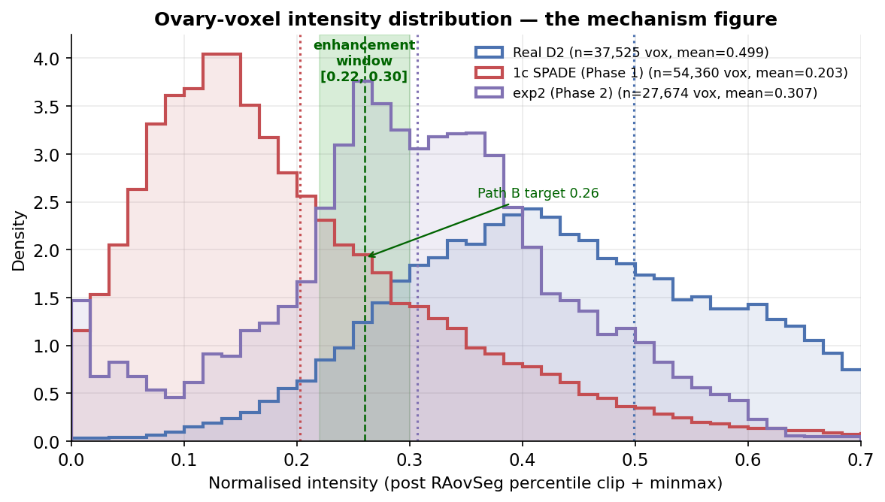
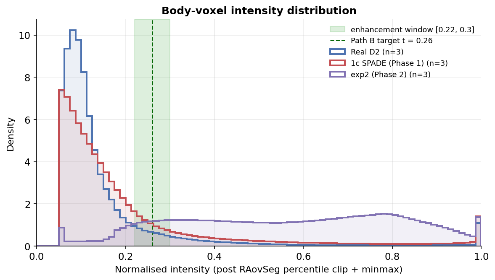
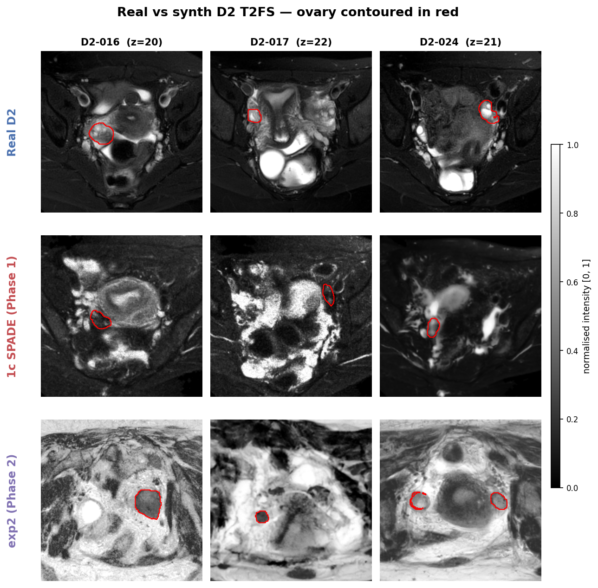
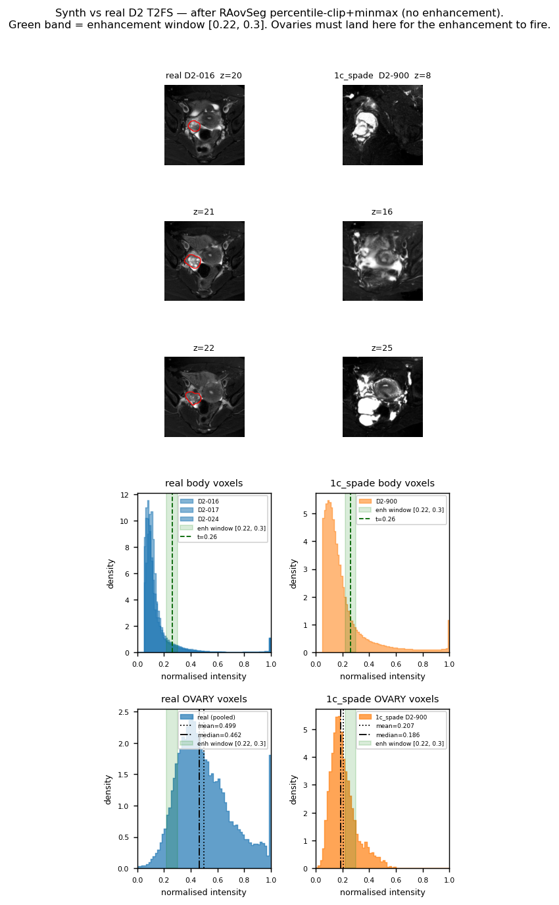

# The Ovary-Intensity Issue — What Breaks, and Every Knob We Can Turn

A single-document reference on why our synthetic MRIs fail downstream
segmentation (RAovSeg), what "ovary intensity" actually means end-to-end,
and every parameter — training-time, inference-time, and post-processing —
that we can move to fix it. Cross-links to the code and to the figures you
should open next to each section.

> **TL;DR** — RAovSeg segments ovaries with a hard-coded intensity heuristic:
> pixels whose normalised intensity falls in `[o1=0.22, o2=0.30]` get pushed
> to the "ovary" band; everything else gets suppressed. Real D2 ovary voxels
> have only ~10% of their mass in that window; our synth variants push
> 15–26% into it, but the *shape* of the histogram is wrong (mean too low,
> long tail into the body distribution). We have four families of knobs —
> generator conditioning, inference sampling, post-processing rescale, and
> the segmenter itself — and each shifts the ovary histogram in a different
> way. This document maps knob → visual outcome.

---

## 1. Why the intensity issue exists at all

### 1.1 What RAovSeg actually does — the end-to-end pipeline

RAovSeg is *not* a single learned segmenter. It is a four-stage pipeline
where the intensity assumptions baked into the **preprocessing** step
determine what the learned components ever see. Two of the four stages
are pure image processing (no learned parameters); one is a slice-level
classifier; one is a pixel-level segmenter.

```
     ┌───────────────────┐  ┌───────────────────┐  ┌───────────────────┐  ┌───────────────────┐
raw  │ (1) PREPROCESS    │  │ (2) RESCLASS      │  │ (3) ATTUSEG       │  │ (4) POSTPROCESS   │
NIfTI│  resample →       │→ │  per-slice binary │→ │  pixel-level      │→ │  morphological    │→ mask
     │  percentile-clip →│  │  "has ovary?"     │  │  ovary mask on    │  │  closing + keep   │
     │  ENHANCEMENT      │  │  (learned)        │  │  flagged slices   │  │  largest CC       │
     │  (hard-coded)     │  │                   │  │  (learned)        │  │  (hard-coded)     │
     └───────────────────┘  └───────────────────┘  └───────────────────┘  └───────────────────┘
     src/RaovSeg_recreation/    train_resclass.py    train_attuseg.py     RAovSeg_tools.py:150
     preprocess.py:65-83
```

#### Stage 1 — Preprocess (hard-coded)

Three sub-steps, applied to every subject (real or synth) before any
learned component sees it:

**(a) Resample.** `ImgResample` interpolates the volume to isotropic
0.5 × 0.5 × 0.5 mm spacing so subsequent CNN kernels see a consistent
physical scale (`RAovSeg_tools.py:33`).

**(b) Percentile-clip normalisation.** `ImgNorm(norm_type="percentile_clip",
low=1, high=99)` clips the raw intensity to its 1st and 99th percentile,
then rescales linearly to `[0, 1]`. This is what puts every voxel on the
common intensity axis all downstream steps assume.

**(c) Enhancement — the intensity-band trick.** `preprocess_(o1=0.22,
o2=0.30)` in `RAovSeg_tools.py:68`. This is the load-bearing step:

```python
def preprocess_(input, o1, o2):
    mn, mx = np.min(input), np.max(input)
    input_norm = (input - mn) / (mx - mn)          # (redundant on [0,1] input)
    out = input_norm.copy()
    out[input > o1] = 1                            # (a) 0.22 < x       → 1.0
    out[input < o1] = input[input < o1]            # (b) x < 0.22       → keep
    out[input > o2] = input[input > o2]            # (c) x > 0.30       → keep (overrides (a) above 0.30)
    out[input > 0.5] = 1 - input[input > 0.5]     # (d) x > 0.5        → fold: 1 - x
    return out
```

Reading the four lines in order, the net effect is:

| Input voxel value | Post-enhancement value | Interpretation |
|---|---|---|
| ≤ 0.22 | unchanged (dark stays dark) | bowel, background — suppressed |
| **0.22 < x ≤ 0.30** | **clamped to 1.0** | **ovary band — brightened to max** |
| 0.30 < x ≤ 0.50 | unchanged | intermediate tissue — passed through |
| > 0.50 | `1 − x` (folded to `[0, 0.5)`) | bright tissue (fat, fluid) — inverted to dark |

The whole logic hinges on one assumption baked into `o1 = 0.22, o2 = 0.30`:
**a real T2FS ovary, after percentile-clip normalisation, has a lot of
voxels in `[0.22, 0.30]`**. When that assumption holds, ResClass and
AttUSeg get an image where ovaries pop to maximum brightness and
surrounding fat has been folded to darkness — a much easier
discrimination problem than the raw MRI would pose. When it *doesn't*
hold (either because a real subject's ovary is atypically dim/bright,
or because the input is synthetic and the generator learned in plain
`[0, 1]` space with no knowledge of the enhancement band), the ovary
never gets the brightness boost and the learned stages are trained on
essentially unenhanced input where the "ovary = bright" prior no longer
applies.

*See:* [RAovSeg_tools.py:68-90](RAovSeg/RAovSeg_tools.py#L68-L90) and
[src/RaovSeg_recreation/preprocess.py:65-83](src/RaovSeg_recreation/preprocess.py#L65-L83).

#### Stage 2 — ResClass (learned, per-slice)

A small ResNet-based classifier that predicts a probability of the slice
containing any ovary tissue. Its input is the enhanced image from
Stage 1(c); its output is a scalar per slice, thresholded at
`RESCLASS_THRESHOLD = 0.6` (paper doesn't specify; we tuned this on the
training-set validation split — see `evaluate.py:31` and
`sweep_threshold.py`). Slices below threshold are skipped by Stage 3.

**Why this matters here:** ResClass's decision rule "does this slice
look like the enhanced-ovary training examples?" is directly dependent
on Stage 1(c) firing. Feed it un-enhanced synth (because the ovary voxels
didn't land in `[0.22, 0.30]`) and it will drop most slices as
"no ovary" — the downstream DSC collapses before AttUSeg is even
consulted.

#### Stage 3 — AttUSeg (learned, pixel-level)

An attention U-Net that predicts a binary ovary mask on each slice that
Stage 2 passed. Same input frame as ResClass — the enhanced image. Same
dependence on Stage 1(c).

#### Stage 4 — Postprocess (hard-coded)

Applied per subject after AttUSeg produces its raw binary volume
(`RAovSeg_tools.py:150`):

```python
def postprocess_(binary_array, closing_iterations=10):
    closed_array = binary_closing(binary_array, iterations=closing_iterations)  # (a) fill small holes
    labeled_array, num_features = label(closed_array)                            # (b) connected components
    if num_features > 0:
        sizes = [np.sum(labeled_array == k) for k in range(1, num_features + 1)]
        largest = np.argmax(sizes) + 1
        labeled_array = np.where(labeled_array == largest, labeled_array, 0)     # (c) keep only largest
    return (labeled_array > 0).astype(int)
```

Two operations: **binary closing** with 10 iterations (fills small
holes, joins nearby fragments), then **keep only the largest connected
component**. This is a strong prior — it assumes the true ovary is a
single blob, which is anatomically valid but bites badly on synth,
where the enhanced-ovary signal is often fragmented across the slice.
When AttUSeg outputs three small blobs instead of one clean one,
postprocess retains only one and discards the other two.

**Net implication of the pipeline for synth:** the two hard-coded
stages (1 and 4) are opinionated priors written for real D2 statistics.
When the synth's ovary intensity distribution or its spatial
coherence violates those priors, the learned stages between them cannot
recover the loss.

### 1.2 The mismatch our synth suffers from

Real D2 ovary voxels sit **broadly** around mean ≈ 0.499, with the
`[0.22, 0.30]` band capturing only ~10% of them
(`figures/mech_ovary_intensity_table.csv`). RAovSeg was tuned against that
distribution — it works because the ovary tissue that IS in the band is
distinctive enough spatially.

Our 1c SPADE synth puts ovary voxels at mean ≈ 0.203, with 15% in the
`[0.22, 0.30]` window — the ovaries are systematically too dark. Phase 2
`exp2` moved the mean to 0.307 and 26% into the window — but the DSC
collapsed anyway (`project_phase2_result` — DSC = 0.020).

Two conclusions from the numeric table:

1. **Just landing in the window is not sufficient.** exp2 has more voxels
   in the band than real (26% vs 10%) but its downstream DSC is *worse*
   than 1c SPADE, because the whole body histogram shifted.
2. **The problem is joint, not marginal.** The ovary voxels have to sit
   in the window *while* the surrounding body voxels stay out of it. If
   the whole image gets pushed into the window, the band no longer
   discriminates.

**→ Open:** [figures/fig_mech_ovary_hist.png](figures/fig_mech_ovary_hist.png)
— the mechanism figure. Green band = `[0.22, 0.30]`. Blue curve = real
ovary voxels. Red / purple curves = synth. See the shape mismatch.

**→ Open:** [figures/fig_mech_body_hist.png](figures/fig_mech_body_hist.png)
— same axis, but for all body voxels. The band should catch the
ovaries *without* catching bulk body tissue.

**→ Open:** [figures/fig_mech_overlay.png](figures/fig_mech_overlay.png)
— visual side-by-side, ovary contoured in red. Look at the ovary region:
is it visibly brighter than surrounding tissue (as in real) or the same
tone (as in 1c SPADE)?

### 1.3 What the enhancement does to synthetic data — visualised

Stage 1(c) (`preprocess_`) was designed against real D2 statistics; its
behaviour on synth is what the intensity plots below show. All three
figures are on the same intensity axis, with the enhancement band
`[0.22, 0.30]` shaded green — the range that gets clamped to 1.0.

**Ovary voxels only** — the key figure for the intensity issue.



*Blue = real D2 ovary voxels, mean 0.499 (10.1% in-band). Red = 1c
SPADE synth ovary voxels, mean 0.203 (15.1% in-band). Purple = Phase 2
exp2 synth, mean 0.307 (26.1% in-band). The green shaded region is
`[0.22, 0.30]` — anything falling inside it gets clamped to 1.0 by
enhancement.*

Two things to read off the figure:

1. **The real curve straddles the band from above.** Real ovaries are
   generally brighter than 0.30, so only ~10% of ovary voxels get the
   brightness boost — but the surrounding fat (voxels > 0.5) gets folded
   down to darkness by rule (d), which produces the contrast that makes
   the ovary visible to ResClass and AttUSeg.
2. **The synth curves straddle the band from below.** Both 1c SPADE
   and exp2 have their ovary mass sitting below 0.30. Enhancement fires
   less consistently on them, and even when it does, the surrounding
   tissue never crosses the 0.5 fold-back threshold — so the contrast
   RAovSeg's learned stages were trained to see is absent.

**Body voxels only** — the counterexample. If the ovary curve straddles
the band, the body curve should *avoid* it (or the band no longer
discriminates).



*Same axis, but for all body voxels. Real body voxels sit broadly around
0.4–0.6, with a manageable slice inside the band. Synth body voxels are
crushed toward lower intensity, which means the band no longer separates
ovary from bulk body — everything below the band looks the same to
Stage 1(c).*

**Side-by-side overlay** — the visual consequence.



*Top row = real subjects (ovary contoured in red). Bottom row = 1c SPADE
synth for the same anatomical region. Real ovaries are visibly brighter
than the surrounding bowel; synth ovaries are the same tone as their
surroundings. This is the exact quality that enhancement was designed
to exploit and that synth fails to produce.*

**Composite view — MRIs + both histograms in one panel.**



*Top: three axial slices from a real D2 subject (D2-016, ovary
contoured in red) next to three slices from 1c SPADE synth (D2-900) —
the real ovary is visibly brighter than surrounding bowel; the synth
ovary is the same tone as its surroundings. Bottom: the body-voxel
and ovary-voxel histograms for these same subjects, with the green
`[0.22, 0.30]` band and the dashed t = 0.26 target overlaid. The
real ovary histogram is centred at mean 0.499 (well above the band);
the synth ovary histogram is centred at mean 0.207 (mostly below the
band). This is the exact composite the mechanism figures decompose into
their three individual panels.*

The four figures together are the visual case that the intensity
mismatch is joint (§1.2 conclusion 2): fixing the ovary mean does not
fix the body tone, and RAovSeg's discrimination needs both.

---

## 2. Where in the pipeline "ovary intensity" is set

The pipeline has three points where the ovary's intensity is decided.
Understanding which point each parameter acts at is the whole game.

```
    ┌──────────────────┐   ┌──────────────────┐   ┌───────────────────────┐
    │ (A) TRAINING     │→  │ (B) INFERENCE    │→  │ (C) POST-PROCESSING   │
    │ conditioning     │   │ DDIM sampling    │   │ intensity rescale     │
    │ decides what     │   │ decides how      │   │ decides where the     │
    │ tone the model   │   │ strongly the     │   │ ovary lands numeric-  │
    │ learns to        │   │ conditioning is  │   │ ally after the fact   │
    │ associate with   │   │ enforced         │   │                       │
    │ each label       │   │                  │   │                       │
    └──────────────────┘   └──────────────────┘   └───────────────────────┘
             │                     │                        │
             ▼                     ▼                        ▼
    ovary_oversample_weight    guidance_scale        ovary_target_intensity
    conditioning type          num_inference_steps   histogram_match
    (concat / SPADE)           cfg_dropout_prob      apply_body_mask
                               iscs_alpha            resample_to_source
```

The generator dataset explicitly does **not** apply RAovSeg's enhancement
during training — it learns in plain `[0, 1]` space:

> *"NOTE: Ovary intensity enhancement is NOT applied here. Generators
> learn in plain [0,1] space; enhancement is downstream RAovSeg-specific."*
> — [src/Generator/dataset.py:17-18](src/Generator/dataset.py#L17-L18)

That is deliberate. The training objective has nothing to do with landing
in `[0.22, 0.30]`; that's a downstream constraint we impose at
post-processing. So the only training-time levers on ovary intensity are
indirect — through what label channels the model sees, and how strongly
ovary-containing slices are sampled.

---

## 3. Family (A) — training-time controls

These change what the model has learned by the time you inference. Moving
them requires re-training.

### 3.1 `ovary_oversample_weight` *(YAML `data.ovary_oversample_weight`)*

Ovary-containing slices are rare in D2 (small organ; visible in only ~20% of
axial slices per subject). Without oversampling, the DDPM sees so few ovary
slices that the ovary label channel becomes near-degenerate — the model
learns to produce a plausible bowel-like tone regardless of the ovary mask.

The sampler up-weights ovary slices by this factor:

```python
def make_weighted_sampler(self, ovary_weight: float) -> WeightedRandomSampler:
    """Oversample ovary-containing slices by `ovary_weight`x relative to others."""
    return WeightedRandomSampler(
        [ovary_weight if s.has_ovary else 1.0 for s in self.index],
        num_samples=len(self.index), replacement=True,
    )
```

*See:* [src/Generator/dataset.py:158-165](src/Generator/dataset.py#L158-L165) and
[src/Generator/train.py:214,241](src/Generator/train.py#L214)

| Value | What happens |
|---|---|
| 1.0 | No oversampling — ovary label channel underused; degenerate |
| **3.0** *(current default)* | ~3× oversample; used in all Phase 1 and Phase 2 |
| 5.0+ | Would risk overfitting to the small ovary subset; not tried |

**What you'd see if you changed this:** lower values → the ovary contour
in `fig_mech_overlay.png` gets less bright, less differentiated from
surrounding bowel. Higher values → sharper contrast at the ovary, but
risk of over-representing the few training subjects with unusual ovary
appearance.

### 3.2 Conditioning type — concat (1a) vs SPADE (1b/1c)

Not a numeric knob, but the biggest architectural lever on intensity
locality. The quantitative CLR result
(`TIER1_TUNING_AND_EXPLAINABILITY.md §11`) showed:

| Variant | CLR_uterus | CLR_L-ov | CLR_em |
|---|---|---|---|
| 1a (concat g=3.0) | 0.013 | 0.043 | 0.028 |
| 1b (SPADE g=2.0) | **0.407** | **0.494** | **0.532** |
| 1c_concat | 0.069 | 0.080 | 0.063 |
| 1c_spade | 0.405 | 0.297 | 0.420 |

SPADE gives 10–30× higher per-organ localisation than concat. That means
when you set the ovary label channel to 1 in a region, SPADE actually
changes the intensity in that region — concat spreads the change
globally.

**→ Open:** [figures/fig_clr_localisation.png](figures/fig_clr_localisation.png)
— CLR bar chart per variant per organ.

**→ Open:** [figures/fig_clr_counterfactual.png](figures/fig_clr_counterfactual.png)
— counterfactual heatmaps showing where each variant changes when the
ovary label is removed.

### 3.3 `cfg_dropout_prob` *(YAML `training.cfg_dropout_prob`)*

Sets how often the label is replaced with the null (zero) label during
training. At 0.1 (default), 10% of training steps train the null model —
this is what makes CFG at inference possible. Lower values → weaker
unconditional prior, so CFG at inference behaves more erratically. Higher
values → the conditional signal is weakened.

Untouched across all four variants. Listed for completeness — this is a
CFG hyperparameter, not an intensity-specific one.

---

## 4. Family (B) — inference-time controls (no retraining)

These act on an already-trained checkpoint. Cheap to sweep.

### 4.1 `guidance_scale` *(YAML `sampling.guidance_scale`, CLI `--guidance-scale`)*

Classifier-Free Guidance amplifies the difference between the conditional
noise prediction and the null prediction:

```python
eps_pred = eps_uncond + guidance_scale * (eps_cond - eps_uncond)
```

*See:* [src/Generator/assemble_synthetic_volumes.py:112-114](src/Generator/assemble_synthetic_volumes.py#L112-L114)

Higher guidance → stronger conditioning → the label channels have more
influence, so the ovary region *should* be brighter and more organ-like.
But high guidance also amplifies high-frequency noise
(`TIER1_TUNING_AND_EXPLAINABILITY.md §3`), so images grow grainy.

The per-variant defaults were set from the Tier 1 sweep:

| Variant | Optimum guidance | Reason |
|---|---|---|
| 1a (concat) | **3.0** | Under-conditioned at 2.0 — ovary tone weak |
| 1b (SPADE) | **2.0** | Grainy at 3.0 — SPADE amplifies noise more |
| 1c_concat | 3.0 | Inherits from 1a |
| 1c_spade | 2.0 | Inherits from 1b |

**What you'd see if you changed this:** open `fig_mech_ovary_hist.png` and
imagine the red curve sliding left (lower guidance) or right (higher
guidance). Lower guidance → ovary voxels darker → less overlap with the
green band → RAovSeg fails. Higher guidance → ovary voxels brighter, but
graininess in the rest of the image → RAovSeg's `input > 0.5` fold-back
starts firing over bowel too.

### 4.2 `num_inference_steps` *(YAML `sampling.num_inference_steps`, CLI `--num-inference-steps`)*

Number of DDIM denoising steps at inference. More steps = finer-grained
denoising trajectory, cleaner textures, longer runtime.

| Value | What happens |
|---|---|
| 50 | Training default; SPADE variants show grain |
| **100** *(current default)* | Clean texture in most cases; standard |
| 250 | Diminishing returns; ~5× slower |

Not a direct intensity control, but noise level affects RAovSeg's
downstream heuristic — noisy pixels randomly fall in and out of the
`[0.22, 0.30]` window, so the ovary saliency map gets fragmented.

### 4.3 `iscs_alpha` *(CLI `--iscs-alpha`, default 0.8)*

Inter-Slice Consistent Stochasticity — mixes a shared noise base across
slices in a volume so adjacent slices look coherent instead of
independently random.

```python
alpha = float(iscs_alpha)
coeff_shared = alpha
coeff_indep = math.sqrt(max(0.0, 1.0 - alpha * alpha))
# per-slice initial noise:
x = coeff_shared * eps_shared + coeff_indep * eps_indep
```

*See:* [src/Generator/assemble_synthetic_volumes.py:90-104](src/Generator/assemble_synthetic_volumes.py#L90-L104)

| Value | What happens |
|---|---|
| 0.0 | Fully independent slices → flickery volume, ovary tone jumps z→z+1 |
| **0.8** *(default, Kwon & Ye ICLR 2025)* | Anatomically coherent volume |
| 1.0 | All slices identical given identical label — degenerate |

Doesn't shift the ovary histogram's *mean*, but affects the per-subject
variance. Low alpha → the ovary might be bright on one slice and dark on
the next, which throws off RAovSeg's per-volume normalisation.

**→ Open:** [figures/fig_iscs.png](figures/fig_iscs.png) — visualises
coherence at different alpha values.

---

## 5. Family (C) — post-processing controls (the intensity dial)

This is where **the actual "choose ovary intensity" code lives**. The
generator produces images in the `[-1, 1]` DDPM space; before the volume
is saved for RAovSeg, we apply a series of remaps that decide where the
ovary voxels land on the `[0, 1]` axis. All of these live in
[src/Generator/assemble_synthetic_volumes.py:188-323](src/Generator/assemble_synthetic_volumes.py#L188-L323).

### 5.1 `ovary_target_intensity` — Path B, the label-aware rescale *(the main knob)*

This is the code that literally chooses the ovary's post-normalisation
intensity. It applies a per-volume additive offset only to the pixels the
label channel says are ovary, so those pixels land at
`target_normalized` in RAovSeg's `[0, 1]` frame:

```python
def _label_aware_ovary_rescale(
    synth_arr_raw: np.ndarray,
    ovary_mask: np.ndarray,
    raw_p1: float, raw_p99: float,
    target_normalized: float = 0.26,   # middle of [0.22, 0.30]
) -> np.ndarray:
    """Per-volume additive offset on ovary pixels so they land at
    `target_normalized` after RAovSeg's percentile-clip + minmax."""
    if not ovary_mask.any():
        return synth_arr_raw

    target_raw = float(target_normalized) * (raw_p99 - raw_p1) + raw_p1
    current_ovary_mean = float(synth_arr_raw[ovary_mask].mean())
    offset = target_raw - current_ovary_mean

    synth_arr_raw = synth_arr_raw.copy()
    synth_arr_raw[ovary_mask] = synth_arr_raw[ovary_mask] + offset
    return synth_arr_raw
```

*See:* [src/Generator/assemble_synthetic_volumes.py:123-158](src/Generator/assemble_synthetic_volumes.py#L123-L158)

**Why an *additive* offset and not multiplicative:** if you multiply, the
brightest ovary voxels become brighter than 1 and get clipped, and the
dimmest go to zero. The additive version preserves the *shape* of the
ovary intensity distribution (its variance, its texture) and just slides
the whole thing to the target mean. Only the mean is guaranteed to land
at the target; individual voxels can still spread above and below.

**Available values (already tried across Phase 1 and Phase 2):**

| Value | Purpose | Script |
|---|---|---|
| `-1` (disable) | Baseline — no rescale, generator's raw output | (any without this flag) |
| 0.22 | Push ovaries to the *lower* edge of RAovSeg's band | [assemble_synth_1c_spade_t022.sh](scripts/assemble_synth_1c_spade_t022.sh) |
| **0.26** *(default)* | Middle of `[0.22, 0.30]`; middle of enhancement window | [assemble_synth_exp2.sh](scripts/assemble_synth_exp2.sh) |
| 0.28 | Push ovaries to the *upper* edge | [assemble_synth_1c_spade_t028.sh](scripts/assemble_synth_1c_spade_t028.sh) |
| 0.30 | Edge — anything higher gets folded by `input > 0.5` step | (not tried) |
| 0.40+ | The `input > 0.5` fold-back starts kicking in; unusable | (not tried) |

**Side effects that matter:**

1. The offset changes the ovary region's *local appearance* — it gets
   visibly brighter or darker. Since the ovary is a tiny fraction of total
   pixels (<1%), the volume-wide `p1`/`p99` percentiles barely shift, so
   the rest of the body keeps its post-normalisation distribution.
2. Because it acts only on the labelled mask, the *ovary contour becomes
   visible as a hard-edged intensity discontinuity* if the offset is
   large. Look for that in `fig_mech_overlay.png` — a synthetic that's
   been pushed hard sometimes has a visible "cutout" around the ovary.
3. If the label channel is wrong (e.g. the ovary mask is bigger than the
   actual ovary tissue in the generated image), the rescale brightens
   non-ovary pixels. This is a failure mode we did not try to
   correct — the label mask is the label mask.

### 5.2 `histogram_match` *(CLI `--no-histogram-match` to disable, on by default)*

Before the ovary rescale, the whole synth volume is histogram-matched to
the raw real subject's intensity distribution:

```python
def _histogram_match(source_01, reference_01):
    # sorted-CDF: for each unique source value, find the reference value
    # with the matching cumulative probability
    src_values, src_inverse, src_counts = np.unique(src_flat, return_inverse=True, return_counts=True)
    ref_values, ref_counts = np.unique(ref_flat, return_counts=True)
    src_cdf = np.cumsum(src_counts).astype(np.float64) / src_flat.size
    ref_cdf = np.cumsum(ref_counts).astype(np.float64) / ref_flat.size
    interp = np.interp(src_cdf, ref_cdf, ref_values)
    matched = interp[src_inverse].reshape(source_01.shape).astype(np.float32)
    return matched
```

*See:* [src/Generator/assemble_synthetic_volumes.py:161-185](src/Generator/assemble_synthetic_volumes.py#L161-L185)

Purely rank-based — it does not know which pixels are ovary. That's why
Path B (5.1) exists on top of it: histogram matching aligns
*distributions* but not *organ intensities*. If the synth naturally puts
the ovary at rank 20% of the intensity distribution and real has it at
rank 60%, matching will push the ovary to whatever intensity is at rank
20% of real — which is not the ovary intensity of real.

**Toggling:** `--no-histogram-match` disables it. Then the synth's
`[0, 1]` distribution is passed through as-is; RAovSeg's percentile clip
still fires, so the final histogram is close to `[0, 1]` shape but not
identity with real. Path B still works on top of no-hist-match, but the
starting distance is bigger, so the additive offset has to be larger and
the "cutout" effect (§5.1 side effect 2) gets more pronounced.

### 5.3 `apply_body_mask` *(CLI `--no-body-mask` to disable, on by default)*

Zeros out synth pixels outside the body silhouette (using the
`outside_body` label channel). Prevents "outside-body hallucinations"
where the DDPM produces bright tissue-like content in the air region,
which then gets mistaken for anatomy by RAovSeg.

*See:* [src/Generator/assemble_synthetic_volumes.py:236-240](src/Generator/assemble_synthetic_volumes.py#L236-L240)

Not directly an ovary-intensity control, but it changes the volume-wide
`p1`/`p99` percentiles (since it kills a lot of otherwise-bright noise
outside the body), which in turn shifts where every subsequent intensity
lands after RAovSeg's normalisation.

### 5.4 `resample_to_source` *(CLI `--no-resample-to-source` to disable, on by default)*

Resamples the synth volume from the generator's body-centered frame
(zoomed in, body fills ~90% of 512²) into the raw real subject's frame
(image-centered, body fills ~60%). Kills the FOV mismatch between the
generator's output and what RAovSeg expects.

*See:* [src/Generator/assemble_synthetic_volumes.py:302-318](src/Generator/assemble_synthetic_volumes.py#L302-L318)

Bilinear interpolation of the image (linear) and nearest-neighbour of the
ovary mask — so the mask stays binary but the image gets slightly blurred
at the ovary boundary. That blurring softens the "cutout" edge from §5.1.

---

## 6. Family (D) — the segmenter itself

We usually treat RAovSeg as fixed, but two of its parameters directly
control what counts as "ovary intensity" and are worth mentioning
because they show *how much of the problem is us vs how much is
segmenter-side*.

### 6.1 `o1`, `o2` — the enhancement window

Defined in [RAovSeg/RAovSeg_tools.py:68-90](RAovSeg/RAovSeg_tools.py#L68-L90).
Tutorial uses `o1=0.24, o2=0.30`; our diagnostics use `o1=0.22, o2=0.30`.

Moving `o1` down or `o2` up widens the window — more permissive, but at
the cost of catching bowel/uterus tissue too. The current values were
inherited from the RAovSeg paper.

**If we broadened the window to `[0.15, 0.35]`** the current 1c SPADE
synth (mean 0.203, 15% in band) would capture ~30% of ovary voxels; but
so would ~40% of surrounding body tissue. The joint constraint
(§1.2 conclusion 2) is why this is not a free win.

### 6.2 The `input > 0.5` fold-back

The line `out[input > 0.5] = 1 - input[input > 0.5]` in `preprocess_`
maps bright pixels (fat, fluid) back into the ovary band. This is why
overshooting `ovary_target_intensity` above ~0.4 is disastrous — the
whole ovary gets folded down and looks like the fat tissue outside.

---

## 7. What "improving the generated image" looks like — the four axes

To read the outcome of any parameter change, we look at four things
against the same set of subjects:

### Axis 1 — visual overlay
**Figure:** [figures/fig_mech_overlay.png](figures/fig_mech_overlay.png)

Rows = variants (real, 1c SPADE, exp2, etc). Columns = subjects. Ovary
is contoured in red.

What to look for: does the ovary region look *distinctly* brighter than
the surrounding bowel/uterus tissue? Real does. 1c SPADE almost doesn't.
exp2 does at some subjects and blows out at others.

### Axis 2 — body-voxel histogram
**Figure:** [figures/fig_mech_body_hist.png](figures/fig_mech_body_hist.png)

The `[0.22, 0.30]` band is shaded green. Each variant contributes one
curve.

What to look for: the *green band should have a shoulder* (a plateau or
bump) for a variant that lands the ovary correctly. Bulk body tissue
should sit above the band (in the 0.4–0.6 range). If the whole curve
gets crushed into the band, RAovSeg's discrimination collapses.

### Axis 3 — ovary-voxel histogram
**Figure:** [figures/fig_mech_ovary_hist.png](figures/fig_mech_ovary_hist.png)

The mechanism figure. Ovary voxels *only*, one curve per variant. Dashed
lines mark each variant's mean. The green band is `[0.22, 0.30]`, the
darker vertical is the Path B target 0.26.

What to look for:
- **Mean vertical** — where is it relative to the band? Ideal = inside
  it or at 0.5 (real's mean).
- **Overlap with band** — quantified in the CSV as `pct_in_window`.
- **Curve shape** — a narrow spike near the target implies over-rescaling
  (the additive offset is doing all the work); a broad hump implies the
  generator itself has learned the right tone.

### Axis 4 — the numeric table
**File:** [figures/mech_ovary_intensity_table.csv](figures/mech_ovary_intensity_table.csv)

For each variant and each subject: `n_vox, mean, median, p10, p90,
pct_in_window`. Same content as the histograms but exact.

Current numbers (2026-07-17):

| Variant | pct_in_window | mean | Downstream DSC |
|---|---|---|---|
| Real D2 (pooled) | 10.1% | 0.499 | 0.290 (baseline) |
| 1c SPADE Phase 1 | 15.1% | 0.203 | 0.178 ± 0.054 |
| exp2 Phase 2 | 26.1% | 0.307 | 0.020 |

The exp2 row is the lesson: **you can maximise pct_in_window and still
tank the DSC**. Landing in the band on aggregate is not equivalent to
landing the right pixels in the band. That's why the four-axis reading
matters — the CSV alone will mislead you.

---

## 8. Related failure-mode figures worth having open

- [figures/fig_failure_modes.png](figures/fig_failure_modes.png) —
  D2-005 and D2-023, the two universal RAovSeg failures. Real ovaries
  that are small, dim, and near the sidewall — RAovSeg fails on them
  because they don't sit in the `[0.22, 0.30]` band even in real data.
  Any synthetic improvement bounded by these subjects.
- [figures/fig_preprocess_progression.png](figures/fig_preprocess_progression.png)
  — v1 → v2 → v3 preprocessing fixes applied to a synth slice. Shows
  what body-mask + histogram-match + resample-to-source each contribute.
- [figures/fig_pipeline_stages.png](figures/fig_pipeline_stages.png) —
  real image → label → synth → overlay. End-to-end view.
- [figures/fig_phase2_collapse.png](figures/fig_phase2_collapse.png) —
  Phase 2 result showing the DSC collapse despite better `pct_in_window`.
- [figures/fig_conditioning_schematic.png](figures/fig_conditioning_schematic.png)
  — concat vs SPADE architecturally. Explains why Family (A) matters.

---

## 9. A one-page decision matrix

You're staring at a bad synth. Which knob do you turn?

| Symptom | Likely cause | Knob (family) | Cost |
|---|---|---|---|
| Ovary voxels systematically *too dark* (mean < 0.2) | Weak conditioning | `guidance_scale` up (B) or `ovary_target_intensity` up (C.1) | free |
| Ovary voxels *too bright* (mean > 0.4), fold-back firing | Over-guidance or over-rescale | `guidance_scale` down (B) or `ovary_target_intensity` = 0.26 (C.1) | free |
| Ovary contour looks "cut out" from surroundings | Additive offset too large; body tone doesn't match | `histogram_match` on (C.2), or reduce `ovary_target_intensity` (C.1) | free |
| Bright hallucinations outside body | Missing body mask | `apply_body_mask` on (C.3) | free |
| Ovary tone jumps slice-to-slice within a volume | Low ISCS coherence | `iscs_alpha` up toward 0.8 (B) | free |
| Ovary looks like generic bowel (no organ specificity) | Concat conditioning at data scale | Switch to SPADE (A), retrain | ~day HPC |
| `pct_in_window` looks fine but downstream DSC drops | Wrong pixels in window | Look at Axis 1 & 3 together, not CSV alone | analysis |
| Real subjects D2-005 / D2-023 fail | Not synth's fault — real ovary out of band | Consider RAovSeg-side widening of `[o1, o2]` (D.1) | risky |

---

## 10. What we haven't tried

For completeness — parameters that exist in the code but that we have
not yet swept:

1. **`ovary_target_intensity ∈ {0.18, 0.20, 0.24}`** — we tried 0.22,
   0.26, 0.28. The lower end (0.22 or below) puts the ovary at the edge
   of the band, where a small variance below turns it into bowel.
2. **`iscs_alpha ∈ {0.5, 0.9}`** — we only ran 0.8. Lower alpha might
   help if the training set has high per-slice variance; higher alpha
   might over-couple.
3. **Multiplicative ovary rescale** — as an alternative to additive.
   Would preserve dark/bright ovary voxels' contrast internally but risk
   clipping. Not implemented.
4. **Per-organ label-aware rescale** — the same trick for uterus and em.
   Not implemented; RAovSeg only uses the ovary band.
5. **RAovSeg-side widening of `[o1, o2]`** — `[0.20, 0.32]` or
   `[0.18, 0.35]`. Would need to be validated against real to check the
   uterus doesn't leak in.

Each of these is one flag or one experiment away.

---

## 11. Methodological note — where t = 0.26 comes from, and what DSC we report

Two questions that come up whenever anyone reads the Path B numbers:
*was `t = 0.26` tuned against data?* and *are the DSC numbers in
Chapter 4 test-set or validation-set?*

### 11.1 Why t = 0.26 specifically

`t = 0.26` is **not tuned** — it is the arithmetic midpoint of RAovSeg's
fixed enhancement window `[0.22, 0.30]`. That window is set by
`o1 = 0.22, o2 = 0.30` in `preprocess_` (`RAovSeg_tools.py:68`) — a
Liang et al. specification we inherited unchanged. Given a target of
"place the ovary voxels somewhere inside the enhancement band so rule
(a) fires on them", the midpoint is the a-priori sensible choice: it
maximises distance from both edges, minimising the chance that a
downstream perturbation (histogram matching, per-subject variance)
knocks the ovary out of the band on either side.

The relevant lines in `assemble_synthetic_volumes.py`:

```python
target_normalized: float = 0.26,   # middle of [0.22, 0.30]
```

**This matters for the writeup.** Because `t = 0.26` was chosen
analytically rather than tuned against any held-out DSC, quoting its
test-set DSC does not constitute selection-on-test leakage. The
methodology is clean *as long as* we don't retrospectively cite the
t = 0.22 / t = 0.28 sweep as evidence that t = 0.26 is optimal — that
framing *would* be leakage because those sweeps were evaluated on the
same 8-subject test set (see §11.3). The safe framing is:
"t = 0.26 was chosen a-priori as the window midpoint; the ±0.02
sweep is a sensitivity analysis showing the exact target does not
carry the finding."

### 11.2 What DSC every table in Chapter 4 reports

**All DSCs quoted in Ch 4 tables are test-set DSC on the 8 sacred D2
subjects.** Confirmed via three code paths:

| File | Line | Evidence |
|---|---|---|
| `evaluate.py` | 2–3 | *"Evaluation pipeline: ResClass → AttUSeg → Post-processing → DSC. Runs the full RAovSeg pipeline on test subjects."* |
| `evaluate.py` | 88–90 | `--test-dir` defaults to `data/processed/test` — the 8-subject holdout |
| Every `run_raovseg_aug_*_seed*.sh` | line 68 comment | *"Stage 4: evaluate on the 8 sacred test subjects"* — followed by `evaluate.py --test-dir $OUT_BASE/processed/test` |

The specific t = 0.26 numbers under this evaluation regime:

| Configuration | DSC | n | Source |
|---|---|---|---|
| SPADE v3 @ t = 0.26 | **0.218 ± 0.057** | 3 seeds | Ch 4 §4.3.5 headline table |
| SPADE v3 @ t = 0.26 (variance study) | **0.178 ± 0.054** | 8 seeds | Ch 4 §4.4 revised figure |

Both are on the 8-subject test set. The 0.178 figure is the more
defensible one because n = 3 seeds gave optimistically biased variance
estimates — see the variance-study discussion in `project_variance_findings`.

### 11.3 Where the internal train/val split lives (and what it's used for)

`train_attuseg.py:136-144` carves an internal subject-level train/val
split *out of `train_val/`* using `--seed 42`. That validation DSC is:

- Used for early stopping and per-epoch monitoring inside
  `train_attuseg.py`.
- Used once by `sweep_threshold.py` to pick the ResClass binary
  threshold at 0.6 (`evaluate.py:31` comment: *"Validation-tuned…"*).
- **Never** the number reported in Ch 4 tables — those come from
  `evaluate.py --test-dir …/processed/test`.

**Implication for the t sweep.** The t = 0.22 / t = 0.26 / t = 0.28
seed scripts all point `evaluate.py` at the test set, not at the
internal val split. If we wanted to promote "we picked t = 0.26" from
"a-priori window midpoint" to "empirically the best target", the
disciplined path is to re-run the sweep evaluating on the internal val
split (three extra runs × three seeds each), pick t there, then quote
the test-set DSC at the picked t. Whether that is worth the compute
budget is a Ch 4 framing decision, not a methodological question about
existing numbers.
